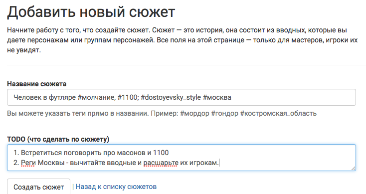

# Создание сюжета
**Меню → Сюжеты → Все → Создать новый**

После чего надо заполнить поля и нажать «сохранить».

## Поле «Название сюжета»
В поле «название сюжета», кроме непосредственно названия сюжета, можно для удобства дальнейшей навигации и структуризации сюжетов вставить *теги*.

 Сюжет можно создать только при наличии «названия». Тег названием не является.

## Теги
Тег обязательно начинаются со спец.символа хештег - #,
в тегах можно использовать *русские* и *латинские буквы*, *цифры* и *нижнее подчеркивание*. Все остальные спец. символы будут считаться частью названия сюжета,
для разделения между хештегами можно ставить *запятую, точку с запятой* или *пробел*.

## Поле TODO
Это поле - внутренний мастерский инструмент для того чтобы не забыть что нужно еще сделать.
Используйте его для того, чтобы отметить, какие тексты вы еще хотите написать, какие завязки подобрать, с какими мастерами что следует проговорить и т.п.

 Если это поле заполнено, то сюжет не будет переведен в статус «готов» даже если все вводные внутри сюжета будут готовы и опубликованы.

Нажав на «Сохранить», вы создадите сюжет.
Дальше можно продолжать работать с этим сюжетом и начать создавать Вводные, либо нажать «Назад к списку сюжетов» и вернуться к списку всех сюжетов.

## Статусы сюжетов

Статусы сюжетов соответствуют статусам вводных, из которых состоит сюжет.

Если в сюжете нет вводных, то статус сюжета будет «в работе».
Если в сюжете есть хотя бы одна вводная «в работе», то статус сюжета будет «в работе».
Если в сюжете все вводные закончены, но заполнено поле TODO, то статус сюжета будет «в работе».
